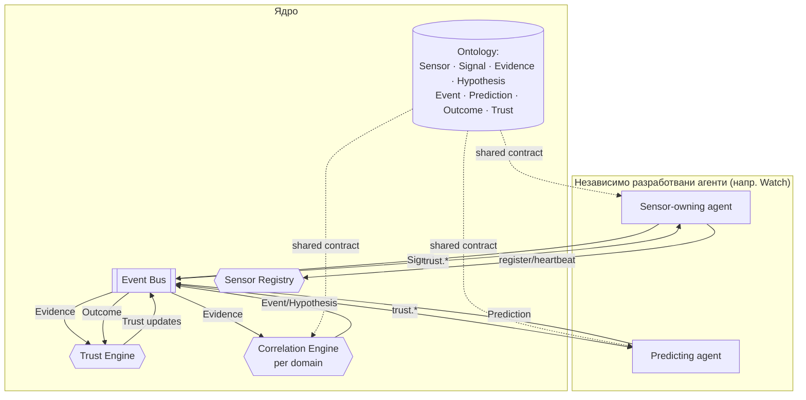

# Reality Observatory

Reality Observatory погълва разнородни сигнали за реалния свят и произвежда
достоверен, одитируем модел на „какво се случва" и „какво е вероятно да се
случи". Проектирана е да расте до десетки независимо разработвани агенти,
без централен бутилков елемент и без агентите да си вярват безусловно.

Този документ е входна точка. Нормативните решения са в `docs/adr/` —
прочети ги, преди да променяш ядрото.

## Архитектура накратко

- **Ядро** = онтология + Event Bus + Trust Engine + Sensor Registry +
  Agent SDK + Correlation Engine. Стабилно, рядко се променя, не съдържа
  доменна логика.
- **Агенти** = единственият начин за добавяне на способност. Независимо
  деплойваеми, комуникират само през Event Bus. Correlation Engine
  инстанции са отделна, domain-exclusive категория — не са агенти.
- **Всичко е immutable факт с provenance** — Signal → Evidence →
  (Hypothesis) → Event, Prediction → Outcome, с Trust като domain-scoped
  изход, изчисляван единствено от Trust Engine.



## Съдържание

| Път | Какво е |
|---|---|
| [`docs/adr/0001-…`](docs/adr/0001-architectural-style-and-system-boundaries.md) | Архитектурен стил и граници на системата |
| [`docs/adr/0002-…`](docs/adr/0002-domain-ontology-as-shared-contract.md) | Онтологията като споделен контракт |
| [`docs/adr/0003-…`](docs/adr/0003-agent-sdk-and-isolation-model.md) | Agent SDK и модел на изолация |
| [`docs/adr/0004-…`](docs/adr/0004-event-bus-topology-and-trust-engine.md) | Event Bus топология и Trust Engine |
| [`docs/adr/0005-…`](docs/adr/0005-sensor-registry-as-core-service.md) | Sensor Registry като основна услуга |
| [`docs/adr/0006-…`](docs/adr/0006-hypothesis-and-domain-scoping.md) | Hypothesis и въвеждане на Domain |
| [`docs/adr/0007-…`](docs/adr/0007-outcome-and-prediction-resolution.md) | Outcome и резолюция на Prediction |
| [`docs/adr/0008-…`](docs/adr/0008-domain-trust.md) | Domain Trust |
| [`docs/adr/0009-…`](docs/adr/0009-prediction-lifecycle.md) | Prediction Lifecycle |
| [`docs/adr/0010-…`](docs/adr/0010-correlation-engine-as-independent-package.md) | Correlation Engine като независим пакет |
| [`docs/adr/0011-…`](docs/adr/0011-type-enforced-constitutional-boundaries.md) | Конституционни ограничения, налагани от типовете |
| [`docs/ontology.md`](docs/ontology.md) | Визуална референция на онтологията |
| [`docs/repository-structure.md`](docs/repository-structure.md) | Структура на репото и conventions |
| [`packages/ontology`](packages/ontology) | `@reality-observatory/ontology` — Sensor, Signal, Evidence, Hypothesis, Event, Prediction, Outcome, Trust |
| [`packages/event-bus`](packages/event-bus) | `@reality-observatory/event-bus` — envelope, topics, publish/subscribe контракт |
| [`packages/trust-engine`](packages/trust-engine) | `@reality-observatory/trust-engine` — domain-scoped read/write контракт, trust policy |
| [`packages/sensor-registry`](packages/sensor-registry) | `@reality-observatory/sensor-registry` — регистрация, discovery, lifecycle на Sensor |
| [`packages/agent-sdk`](packages/agent-sdk) | `@reality-observatory/agent-sdk` — manifest, context, lifecycle контракт; `AgentEventBus` не позволява публикуване на Event |
| [`packages/correlation-engine`](packages/correlation-engine) | `@reality-observatory/correlation-engine` — domain-exclusive Evidence→Event/Hypothesis контракт; `CorrelationEventBus` позволява само Event/Hypothesis |
| [`agents/`](agents) | Всеки независимо разработван агент; вижте `agents/_example-agent` за скелет |
| [`agents/ri-001-reference-watch`](agents/ri-001-reference-watch) | **RI-001** — детерминистична референтна имплементация на Watch агент; постоянен regression test за целия pipeline (ADR-0001…0011) |
| [`agents/ri-002-multi-sensor`](agents/ri-002-multi-sensor) | **RI-002** — три независими Sensor-а/агента, доказващи че Correlation Engine слива много Evidence в точно едно Event без Kernel промяна |

## Статус

Ядрото (`packages/*`) е архитектурна основа (contracts-only): типовете и
интерфейсите дефинират границите на системата, но нарочно **не съдържат
production имплементация** на Event Bus/Trust Engine/Sensor Registry/
Correlation Engine.

RI-001 и RI-002 (`agents/ri-001-reference-watch`, `agents/ri-002-multi-sensor`)
са изключение по дизайн: минимални, изрично маркирани in-memory fixtures
правят целия контракт изпълним и тестваем в детерминирани сценарии,
доказвайки, че архитектурата поддържа както единичен-Sensor цикъла
Observation → Evidence → Event → Hypothesis → Prediction → Outcome →
Trust (RI-001), така и multi-sensor корелация на много Evidence в едно
Event със запазен provenance (RI-002) — и двете без нито една промяна в
`packages/`. Реален runtime и production агенти (започвайки от Oil Regime
Watch) се разработват отделно, върху тази вече доказана основа.

```sh
npm run test   # изгражда и пуска RI-001's и RI-002's regression suites
```
