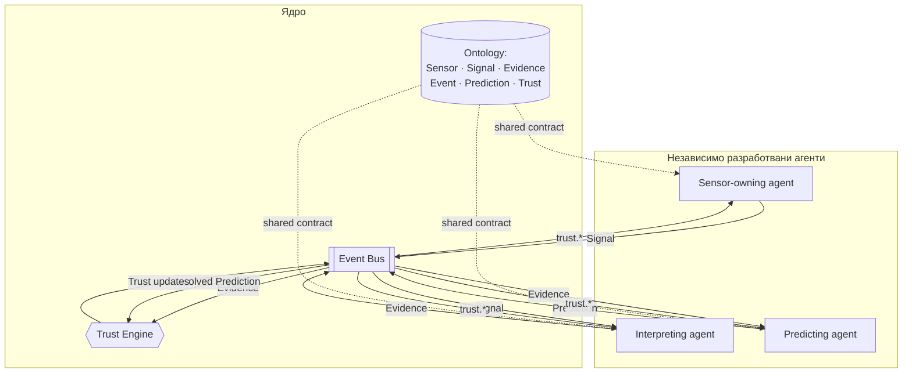

# Reality Observatory

Reality Observatory погълва разнородни сигнали за реалния свят и произвежда
достоверен, одитируем модел на „какво се случва" и „какво е вероятно да се
случи". Проектирана е да расте до десетки независимо разработвани агенти,
без централен бутилков елемент и без агентите да си вярват безусловно.

Този документ е входна точка. Нормативните решения са в `docs/adr/` —
прочети ги, преди да променяш ядрото.

## Архитектура накратко

- **Ядро** = онтология + Event Bus + Trust Engine + Agent SDK. Стабилно,
  рядко се променя, не съдържа доменна логика.
- **Агенти** = единственият начин за добавяне на способност. Независимо
  деплойваеми, комуникират само през Event Bus.
- **Всичко е immutable факт с provenance** — Signal → Evidence → Event →
  Prediction, с Trust като изход, изчисляван единствено от Trust Engine.

## Съдържание

| Път | Какво е |
|---|---|
| [`docs/adr/0001-…`](docs/adr/0001-architectural-style-and-system-boundaries.md) | Архитектурен стил и граници на системата |
| [`docs/adr/0002-…`](docs/adr/0002-domain-ontology-as-shared-contract.md) | Онтологията като споделен контракт |
| [`docs/adr/0003-…`](docs/adr/0003-agent-sdk-and-isolation-model.md) | Agent SDK и модел на изолация |
| [`docs/adr/0004-…`](docs/adr/0004-event-bus-topology-and-trust-engine.md) | Event Bus топология и Trust Engine |
| [`docs/ontology.md`](docs/ontology.md) | Визуална референция на онтологията |
| [`docs/repository-structure.md`](docs/repository-structure.md) | Структура на репото и conventions |
| [`packages/ontology`](packages/ontology) | `@reality-observatory/ontology` — Sensor, Signal, Evidence, Event, Prediction, Trust |
| [`packages/event-bus`](packages/event-bus) | `@reality-observatory/event-bus` — envelope, topics, publish/subscribe контракт |
| [`packages/trust-engine`](packages/trust-engine) | `@reality-observatory/trust-engine` — read/write контракт, trust policy |
| [`packages/agent-sdk`](packages/agent-sdk) | `@reality-observatory/agent-sdk` — manifest, context, lifecycle контракт |
| [`agents/`](agents) | Всеки независимо разработван агент; вижте `agents/_example-agent` за скелет |

## Статус

Това е архитектурна основа (contracts-only): типовете и интерфейсите тук
дефинират границите на системата, но нарочно **не съдържат имплементация**.
Runtime-ът, конкретните реализации на Event Bus/Trust Engine, и самите
агенти се разработват отделно, върху тази основа.
