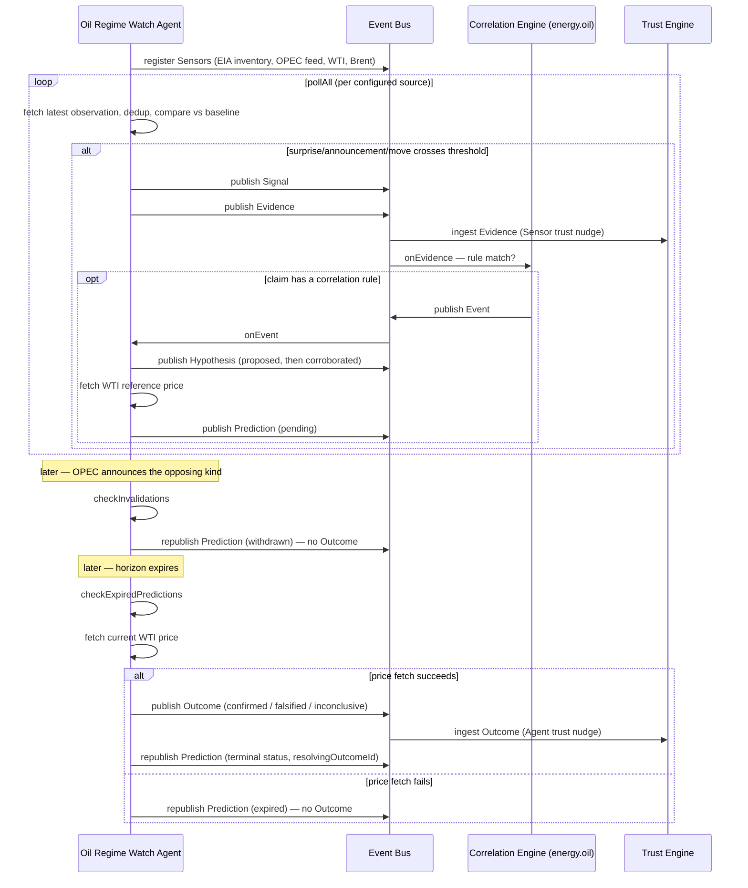

# PA-001 — Oil Regime Watch

Oil Regime Watch is the first **production** Watch agent for Reality
Observatory. Unlike RI-001/RI-002 (fixed, deterministic reference
scenarios that exist only to validate the architecture), this agent is
meant to run continuously against real EIA/OPEC+/price data and accrue
real Domain Trust over time. Its test suite is still fully deterministic
(see "Testing" below) — that discipline doesn't go away just because the
subject matter is now real.

## Scope

Monitors exactly four sources, deliberately nothing else:

- **EIA Weekly Petroleum Status Report** — US crude inventory levels.
- **OPEC+ production announcements** — cuts, increases, and unplanned
  supply disruptions.
- **WTI spot price** and **Brent spot price** — both served by EIA's
  petroleum price data.

No geopolitical reasoning, no macro reasoning, no AI summarization. The
agent's job is to turn these four sources into reliable, falsifiable
Predictions — not to be clever about the world.

## Pipeline

```
Signal → Evidence → Correlation Engine → Event → Hypothesis → Prediction → Outcome → Domain Trust
```

The agent **never publishes Event directly** — this is enforced at the
type level by `AgentEventBus` (`AgentPublishableFact` excludes `Event`,
docs/adr/0011), not merely by convention. `OilRegimeCorrelationEngine`,
the domain's sole authoritative Correlation Engine instance, is the only
thing that can turn Evidence into an Event.

## Correlation Algorithm

Deterministic and rule-based — no AI, no statistical inference:

| Evidence claim | Event type |
|---|---|
| `unexpected-crude-oil-inventory-build` | `energy.oil.inventory-surprise-build` |
| `unexpected-crude-oil-inventory-draw` | `energy.oil.inventory-surprise-draw` |
| `opec-production-cut` | `energy.oil.opec-production-cut` |
| `opec-production-increase` | `energy.oil.opec-production-increase` |
| `opec-supply-disruption` | `energy.oil.opec-supply-disruption` |

Each recognized claim independently and sufficiently constitutes an Event
(unlike RI-002's multi-sensor quorum) — a single confirmed EIA inventory
surprise or a single official OPEC+ announcement is, on its own, a real
occurrence worth an Event. Bare price-move Evidence (`wti-price-surge`,
etc.) deliberately has no correlation rule — price data feeds Evidence and
Outcome resolution, but does not itself trigger a regime Event in this
initial scope. Deduplication is by `EvidenceId`, so re-delivery can never
produce a second Event for the same Evidence.

**Inventory surprise detection**: no external forecast/consensus source is
in scope, so "unexpected" is computed entirely from EIA's own published
history — `surprise = latest week − average(prior N weeks)`
(`N = thresholds.inventoryTrailingWeeks`). If `|surprise|` exceeds
`thresholds.inventorySurpriseThousandBarrels`, it's Evidence.

## Prediction Rules

Every Prediction this agent makes has, by construction (see
`predictionRules.ts`), all of:

- **Clear expected outcome** — `claim.direction: "up" | "down"` for WTI.
- **Measurable condition** — `claim.thresholdPercent` against
  `claim.referencePriceUsd` (the WTI price at Prediction time).
- **Time horizon** — `horizon.from` / `horizon.to`
  (`thresholds.predictionHorizonHours`, default 120h / 5 days).
- **Invalidation condition** — `claim.invalidation.opposingAnnouncementKind`:
  if an OPEC+ announcement of the opposing kind arrives before the horizon
  expires, the Prediction is withdrawn immediately rather than waiting to
  be evaluated against a thesis its own basis no longer supports.
- **Supporting Evidence and originating Event** — `basis` names every
  contributing Evidence, the Event, and the Hypothesis.

Predictions that fail any of these are never constructed — there is no
code path that publishes a Prediction missing one of these fields.

## Outcome Rules

When a Prediction's horizon expires (`checkExpiredPredictions`, meant to be
called on a schedule by the runtime — see "Known limitations"), the agent
re-fetches the current WTI price and evaluates the measurable condition:

- Moved in the predicted direction past the threshold → **confirmed**.
- Moved past the threshold in the opposite direction → **falsified**.
- Neither → **inconclusive**.
- Price could not be fetched at all → **expired**, with **no Outcome**
  (`OutcomeVerdict` only has confirmed/falsified/inconclusive — an expired
  Prediction, per ADR-0009, has none).

The agent publishes the Outcome (when there is one) and republishes the
Prediction with its terminal status — it never mutates a Trust record and
has no writer surface to Trust even if it tried. **Trust Engine, not this
agent, computes the Domain Trust update** once it ingests the Outcome (or
Evidence) from the bus (docs/adr/0004).

## Sequence Diagram



## Configuration

`config/sources.json` — see `src/config.ts` for the loader/validator.
Fails closed: a config whose `domain` disagrees with the agent's hardcoded
`DOMAIN`, or that is missing any of the four required sources, is a
startup error.

| Key | Meaning |
|---|---|
| `sources.eiaInventory` / `eiaWtiPrice` / `eiaBrentPrice` | EIA API v2 route + facets per series (see `EiaHttpClient`) |
| `sources.opecAnnouncements.feedPath` | Path to the operator-curated announcement feed (see `config/opec-announcements.example.json`) |
| `thresholds.inventorySurpriseThousandBarrels` | Minimum `\|surprise\|` (vs trailing average) to count as Evidence |
| `thresholds.inventoryTrailingWeeks` | How many prior weeks the trailing average covers |
| `thresholds.priceMoveEvidenceThresholdPercent` | Minimum day-over-day price move to count as Evidence |
| `thresholds.priceMoveConfirmationThresholdPercent` | The measurable condition threshold used in every Prediction's `claim` |
| `thresholds.predictionHorizonHours` | Default Prediction horizon |
| `apiKeyEnvVar` | Name of the environment variable holding the EIA API key |
| `apiBaseUrl` | EIA API v2 base URL |

`config/opec-announcements.example.json` is a template — copy it to
`opec-announcements.json` and append new entries as OPEC+ makes them
public. This agent deliberately does not scrape or AI-summarize
announcements (see "Scope"); it treats them as structured input an analyst
curates.

## Testing

```sh
npm run test --workspace=@reality-observatory/oil-regime-watch
```

13 deterministic tests (`node --test`, no external framework): config
loading/validation, 5 positive scenarios (inventory report, OPEC
announcement, successful Prediction, failed Prediction, Trust update), and
5 negative scenarios (duplicate observations, invalid source, malformed
Evidence, expired Prediction, duplicate Outcome). All run against the
`Fixture*Adapter` implementations in `src/sources/fixtures/` — the same
kind of in-memory kernel fixtures (`InMemoryEventBus`,
`InMemorySensorRegistry`, `InMemoryTrustEngine`) RI-001/RI-002 used, since
no production runtime implementing those Kernel contracts exists yet (see
"Known limitations" in the Final Report).

## Known limitations (see Final Report for the full assessment)

- **Live EIA connectivity is implemented but unverified.** This
  development session's network policy blocks outbound requests to
  `api.eia.gov` (confirmed: the CONNECT tunnel was denied with HTTP 403).
  `EiaHttpClient`/`EiaInventoryAdapter`/`EiaPriceAdapter` follow EIA's
  documented API v2 conventions, but the exact `route`/`facets` in
  `config/sources.json` should be verified against EIA's live API
  documentation before this agent is deployed for real.
- **No production runtime exists yet.** There is no concrete, deployable
  Event Bus / Trust Engine / Sensor Registry / Correlation Engine
  implementation anywhere in this repo — only contracts (by design, see
  ADR-0001/0005). This agent's real business logic doesn't depend on any
  particular runtime, but it cannot actually run continuously in
  production until one exists.
- **`AgentStorage` has no key-listing method.** Tracking pending
  Predictions requires this agent to maintain its own explicit index key
  (`trackedPredictionIds`) rather than enumerating its own storage — a
  minor, workable friction, not a blocker.
- **This is the third fixture duplication** (`src/fixtures/*` mirrors
  RI-001/RI-002's). See the Final Report for the recommendation.

