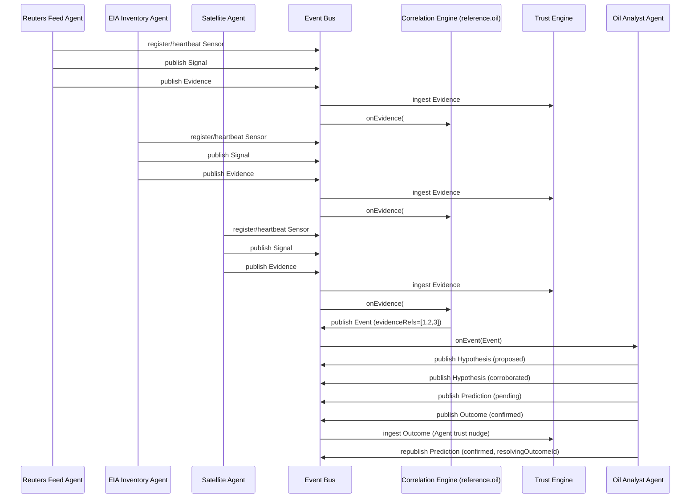

# RI-002 — Multi-Sensor Correlation Reference

RI-002 is not a production agent. It is the second deterministic reference
implementation for Reality Observatory, and its objective is narrower and
more specific than RI-001's: **prove that the Kernel, as it stands, already
supports multiple independent Sensors observing the same real-world
phenomenon and correlating into exactly one canonical Event** — without
requiring any Kernel change.

This task is validation, not extension. See "Kernel changes" below for the
outcome: none were required.

## Scenario

Three independent Sensors, each owned by its own independently-modeled
agent, observe the same phenomenon — **an unexpected crude oil inventory
build** — from different, unrelated sources:

| Sensor | Owning agent | Signal payload |
|---|---|---|
| Reuters Feed | `agent-ri002-reuters` | `{ headline: "Crude oil inventories unexpectedly rise..." }` |
| EIA Weekly Inventory | `agent-ri002-eia` | `{ inventoryChangeMillionBarrels: 8.4 }` |
| Satellite Observation | `agent-ri002-satellite` | `{ estimatedFillLevelChangePercent: 3.2 }` |

Each agent independently runs `Signal -> Evidence`. All three Evidence
objects share the same `domain` (`reference.oil`) and the same `claim`
string (`"unexpected-crude-oil-inventory-build"`), despite having nothing
else in common — different sensors, different agents, different payload
shapes, different confidence (`strength`) values.

A fourth agent, `agent-ri002-oil-analyst`, reacts to the Correlation
Engine's Event by producing a Hypothesis, a Prediction, and — deterministically,
resolving its own Prediction — an Outcome, closing the loop into a Domain
Trust update.

## Correlation Algorithm

The Correlation Engine's rule is deliberately the simplest possible
rule-based match, as instructed: **no AI, no statistical inference.**

```
correlationKey(evidence) = `${evidence.domain}::${evidence.claim}`
```

The engine accumulates incoming Evidence per key in a `Set<EvidenceId>`
(so re-delivery of the *same* Evidence id is automatically a no-op — no
recount, no duplicate). Once the accumulated set for a key reaches a fixed
quorum (`CORRELATION_QUORUM = 3`, matching the three independent sources in
this scenario), the engine emits **exactly one** canonical Event, with
`evidenceRefs` built from every EvidenceId that contributed — complete
provenance, not just the one submission that happened to trigger emission.
Any further Evidence for that key (duplicate or not) after emission is
ignored: the key is marked `emitted` and never emits a second Event.

This is intentionally unintelligent. The purpose of RI-002 is to prove the
*architecture* supports many-to-one correlation — Evidence accumulation,
idempotent deduplication, domain-scoped isolation, exactly-once emission,
full provenance — not to demonstrate a sophisticated correlation strategy.
A production Correlation Engine for a real domain would very likely replace
the exact-claim-string match with something more robust (structured
subject/key extraction, fuzzy matching, statistical corroboration), but
that is explicitly out of scope here and does not change any Kernel
contract — correlation strategy is Correlation-Engine-instance-specific by
design (docs/adr/0010).

## Sequence Diagram



## Architecture Notes

### Kernel invariants verified

- **Domain remains unchanged throughout the pipeline** — every Evidence,
  the Event, the Hypothesis, and the Prediction all carry `domain:
  "reference.oil"`; verified explicitly in
  `test/ri-002.positive.test.ts`.
- **Only the Correlation Engine can publish Event** — enforced at compile
  time by `AgentEventBus` (`AgentPublishableFact` excludes `Event`);
  re-verified for RI-002's own agents in
  `test/type-level.adr-0011.test.ts`.
- **Only the Trust Engine updates Trust** — neither `AgentContext` nor
  `CorrelationContext` expose a `TrustEngineWriter`-shaped field at all
  (both expose only `TrustEngineReader`); there is no call surface through
  which any agent or Correlation Engine instance in this scenario could
  write Trust even if it wanted to. This is a structural property of the
  Kernel packages, not something RI-002 had to newly construct or test at
  runtime.
- **Lineage remains complete** — the Event's `evidenceRefs` names all three
  contributing Evidence; the Prediction's `basis` names the Event, the
  Hypothesis, and all three Evidence; the Outcome's `evidenceEventIds`
  names the Event; the resolved Prediction's `resolvingOutcomeId` names the
  Outcome. Every fact in the chain is traceable back to the three original
  Signals without any gap.

### Kernel changes required

**None.** No `packages/*` file was modified for RI-002. The multi-sensor,
many-Evidence-to-one-Event scenario is fully expressible against the
existing `ontology`, `event-bus`, `trust-engine`, `sensor-registry`,
`agent-sdk`, and `correlation-engine` contracts exactly as they stood after
RI-001 and ADR-0011.

### Observations (not defects)

- **Fixture duplication.** `src/fixtures/*` in this package is near-identical
  to `agents/ri-001-reference-watch/src/fixtures/*`. This is not a Kernel
  issue — it follows directly from the repo convention that agent folders
  never cross-import (docs/repository-structure.md). It is a real
  maintenance cost, though: a future `packages/reference-runtime` (or
  similar) extraction of these in-memory fixtures would remove the
  duplication. Not implemented here — it would be a structural addition to
  `packages/`, and this task is scoped to validation, not extension.
  Recommended as a candidate for a future, explicitly-scoped task.
- **`Event.evidenceRefs` accepts an empty array at the type level.** Nothing
  in the ontology's `Event` type requires at least one element — TypeScript
  could express this with a tuple type (`readonly [EvidenceId, ...EvidenceId[]]`)
  instead of `readonly EvidenceId[]`, which would make "an Event cannot
  exist without supporting Evidence" a compile-time guarantee rather than
  an implementation convention. RI-002's `ReferenceCorrelationEngine` never
  constructs an Event with fewer than `CORRELATION_QUORUM` evidence
  references, and this is verified at runtime by
  `test/ri-002.negative.test.ts`. Not a blocking defect — nothing in this
  task's scenario is prevented by the looser type — so it is not changed
  here; flagged as a minor, optional, future ADR candidate.
- **Non-agent, non-sensor service attribution.** Both the Correlation
  Engine and the Trust Engine must set `Provenance.producedBy: AgentId |
  SensorId` on facts they author, despite being neither an Agent nor a
  Sensor. RI-001 already noted this; RI-002 hits the same seam again
  (`scenario.ts`, `fixtures/InMemoryTrustEngine.ts`). Still not blocking —
  a pragmatic `AgentId`-shaped cast works fine for a reference — but two
  independent reference implementations now hitting the same seam is a
  slightly stronger signal that a dedicated system-service id brand may be
  worth a future ADR.

None of the above required a Kernel change to complete RI-002, and none
block a production Watch agent from being built on the current contracts.

## Running it

```sh
npm run test --workspace=@reality-observatory/ri-002-multi-sensor
```

Builds via `tsc --build` (rebuilding any Kernel package if needed) and runs
all suites via Node's built-in test runner — no external test framework, no
network access, no LLM calls anywhere in the scenario or its correlation
logic.

## Deliberate simplifications (not architectural gaps)

- The Oil Analyst agent resolves its own Prediction (produces the Outcome
  itself), the same simplification RI-001 made — ADR-0007 also permits a
  distinct resolving agent/process.
- `CORRELATION_QUORUM = 3` is hardcoded to match this scenario's three
  fixed sources; a production Correlation Engine would derive its quorum
  (or a smarter aggregation rule) from real domain requirements, not a
  constant.
- The four agents in this package (`ReferenceSensorAgent` is reused for
  all three sensor sources, plus `ReferenceAnalystAgent`) live in one
  package rather than four separate `agents/<id>/` folders, since they are
  all disposable parts of one reference scenario, not independent
  production agents — see `docs/repository-structure.md`'s convention for
  where that boundary applies to real agents.
