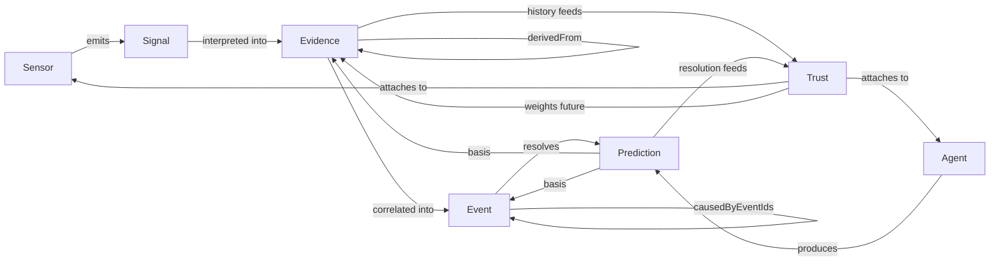

# Онтология

Пълният нормативен текст е в
[ADR-0002](adr/0002-domain-ontology-as-shared-contract.md). Този документ е
бърза визуална референция.

## Типове от първи ред

| Тип | Носи | Immutable? | Кой го произвежда |
|---|---|---|---|
| `Sensor` | Възможности и статус на източник | не (статус се обновява) | регистриращ агент |
| `Signal` | Суров/леко обработен запис | да | Sensor |
| `Evidence` | Интерпретация в подкрепа/опровержение на claim | да | интерпретиращ агент |
| `Event` | Семантичен факт, върху който системата разсъждава | да | detecting агент |
| `Prediction` | Falsifiable твърдение за бъдещето | статус се обновява до resolve | predicting агент |
| `Trust` | Оценка на доверие към Sensor/Agent | да (нов запис при преизчисление) | **само** Trust Engine |

## Диаграма на връзките

## Пакет

Всички типове живеят в `packages/ontology/src` и се експортират от
`@reality-observatory/ontology`. Никой друг пакет или агент не дефинира
собствени варианти на тези шест типа.

## Правило за еволюция на схема

- Само добавящи промени в рамките на минорна версия (`schemaVersion`).
- Всяка breaking промяна изисква нова мажорна версия на конкретния тип и
  документиран migration path в нова ADR.
