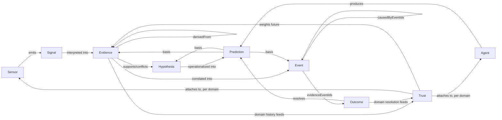

# Онтология

Нормативният текст е в [ADR-0002](adr/0002-domain-ontology-as-shared-contract.md),
разширен от [ADR-0006](adr/0006-hypothesis-and-domain-scoping.md),
[ADR-0007](adr/0007-outcome-and-prediction-resolution.md) и
[ADR-0008](adr/0008-domain-trust.md). Този документ е бърза визуална
референция.

## Типове от първи ред

| Тип | Носи | Immutable? | Кой го произвежда |
|---|---|---|---|
| `Sensor` | Възможности и статус на източник | не (статус се обновява) | Sensor Registry, по заявка на owner агент |
| `Signal` | Суров/леко обработен запис | да | Sensor |
| `Evidence` | Интерпретация в подкрепа/опровержение на claim, за даден `domain` | да | интерпретиращ агент |
| `Hypothesis` | Falsifiable кандидатно обяснение, свързващо Evidence | статус се обновява (нов запис) | предлагащ агент |
| `Event` | Семантичен факт за даден `domain`, върху който системата разсъждава | да | Correlation Engine (за неговия домейн) |
| `Prediction` | Falsifiable, времево ограничено твърдение за бъдещето, за даден `domain` | статус се обновява до terminal (нов запис — виж ADR-0009) | predicting агент |
| `Outcome` | Авторитетен вердикт по конкретна Prediction | да | resolving агент/процес |
| `Trust` | Оценка на доверие към (Sensor \| Agent, `domain`) двойка | да (нов запис при преизчисление) | **само** Trust Engine |

## Диаграма на връзките

## Domain

`Domain` (в `common.ts`) е споделен, namespaced string тип (ADR-0006),
носен от `Evidence`, `Event`, `Hypothesis`, `Prediction` и `Trust`. Не е
самостоятелен ontology тип с провенанс — той е класификационна ос, по
която Correlation Engine (ADR-0010) и Domain Trust (ADR-0008) партиционират
отговорност и доверие. Резервираната стойност `GLOBAL_DOMAIN` (`"*"`)
означава агрегиран/rollup изглед, не конкретен домейн.

## Пакет

Всички типове живеят в `packages/ontology/src` и се експортират от
`@reality-observatory/ontology`. Никой друг пакет или агент не дефинира
собствени варианти на тези осем типа.

## Правило за еволюция на схема

- Само добавящи промени в рамките на минорна версия (`schemaVersion`).
- Всяка breaking промяна изисква нова мажорна версия на конкретния тип и
  документиран migration path в нова ADR (виж ADR-0006, ADR-0007 за
  прецеденти, приложени директно поради липса на production данни към
  момента на промяната).
